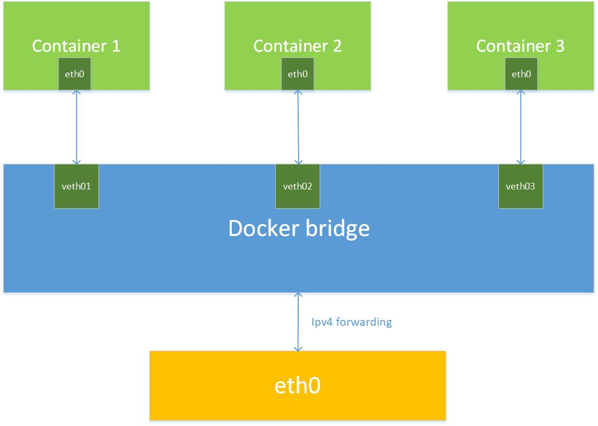

# Сети в docker
Для взаимодействия контейнеров между собой и с внешней средой(хост, интернет) докер имеет механизмы сетевого взаимодействия контейнеров.

Докер поддерживает 3 вида сетей:
1. null (none) - полная сетевая изоляция контейнера, контейнеры в сети none недоступны извне.
2. bridge - в сетях такого типа контейнеры все еще изолированы от сети хоста, но уже доступны изве через сетевые интерфейсы докера(проброс портов, например)
3. host - сетевая изоляция контейнера от хоста полностью отсутствует; можно сказать контейнер стал частью хоста, потому что даже без проброса портов, обратясь к порту localhost'а, который слушает контейнер, мы сможем с ним общаться.

 Изначально докер автоматически создаёт по одной сети каждого типа. При этом по умолчанию все контейнеры становятся частью сети типа bridge. 

 Есть возможность создавать свои bridge-сети, дабы группировать контейнеры по необходимости, изолируя их друг от друга. 

## Команды
 Базовая команда по работе с сетями: `docker network <вспомогательная команда>`
 - `docker network ls` - вывести все имеющиеся сети
 - `docker network create` - создать сеть
 - `docker network rm` - удалить сеть
 - `docker network connect/disconnect` - подключить/отключить контейнер к/из сети
 - `docker network inspect` - вывести информацию о сети
 - `docker network prune` - удалить неиспользующиеся сети

Чтобы подключить контейнер к некоторой сети при его запуске, необходимо передать параметр --net:

`docker run --net=<имя сети> <контейнер>`

## Сети bridge. Сетевое взаимодействие в докере.
Докер позволяет создавать сколько угодно изолированных друг от друга сетей типа bridge и добавлять туда сколько угодно контейнеров. Однако некоторым контейнерам хорошо бы уметь выходить за рамки своей сети: общаться с хостом, с интернетом и с другими контейнерами, находящемися в других bridge-сетях. И докер позволяет это делать.

Для каждой сети bridge докер создаёт виртуальный коммутатор с виртуальными интерфейсами, через которые контейнеры этой сети взаимодействуют друг с другом:

Помимо этого докер реализует маршрутизацию между всеми bridge-сетями. Это можно представить так: все имеющиеся сети, а также хост подключены к виртуальному маршрутизатору. Каждая bridge-сеть имеет шлюз по умолчанию - интерфейс виртуального маршрутизатора в этой сети. 

