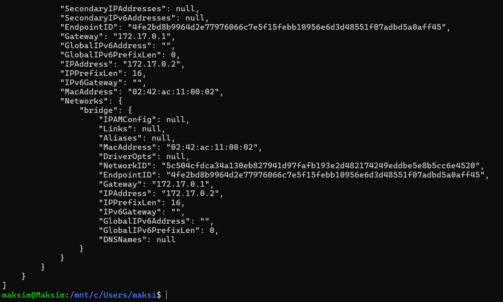

# База данных PostgreSQL в контейнере
## Предварительные действия
1. Скачаем образ postgres: `docker pull postgres`
2. Скачаем образ pgadmin: `docker pull dpage/pgadmin4`
3. Перейдя в папку postgres-app соберём образ тестового приложения: `docker build -t my-postgres-test-app .`
4. Создадим вольюм для базы данных: `docker volume create my-postgres-data`

## Запуск контейнера с базой данных
Для того чтобы запустить базу данных, с которой можно будет установить соединение, необходимо передать следующие переменные окружения:
- POSTGRES_USER
- POSTGRES_PASSWORD
- POSTGRES_DB
  
Также необходимо прокинуть порт. Postgres по умолчанию слушает порт 5432. 

Команда запуска контейнера с postgres:
```bash
$docker run --name my_postgres_db -d -p 5432:5432 -e POSTGRES_USER=maksim -e POSTGRES_PASSWORD=12345 -e POSTGRES_DB=my_db -v my-postgres-data:/var/lib/postgresql/data postgres
```

После запуска контейнера с postgres выполняем команду: `docker inspect my_postgres_db` с целью узнать ip-адрес контейнера:



Его мы будем использовать для обращения к базе данных из других контейнеров.

## Запуск тестового приложения
Теперь проверим возможность обращения к базе данных при помощи контейнера с тестовым приложением.

Для доступа к базе данных нам нужны данные, такие как ip контейнера с БД, имя пользователя, пароль и тд. Эти нехороша хардкодить, поэтому вынесем их в переменные окружения. Причем некоторые не очень секретные были вынесены в докерфайл, а пароль и ip адрес нужно передать при запуске контейнера с тестовым приложением.

Запуск контейнера с тестовым приложением:
```bash
docker run --name my_postgres_test_app -p 8000:8000 -e DB_PASSWORD=12345 -e DB_HOST=172.17.0.2 my-postgres-test-app 
```

Результатом будет вывод в консоль версии postgres. 

## Запуск pgadmin
```bash
docker run --name my_pgadmin -p 5050:80 -e PGADMIN_DEFAULT_EMAIL=maksim@gmail.com -e PGADMIN_DEFAULT_PASSWORD=admin dpage/pgadmin4
```

Переходим в браузере на строницу localhost:5050, регистрируемся, вводим данные БД и всё)
