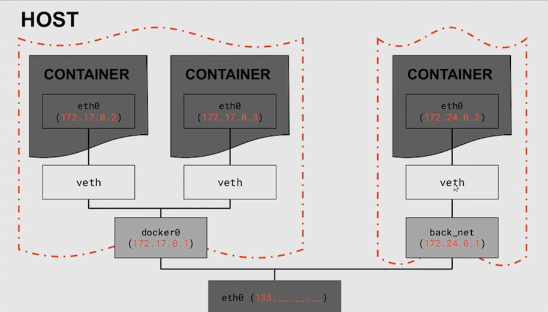

# Сети в docker
Для взаимодействия контейнеров между собой и с внешней средой(хост, интернет) докер имеет механизмы сетевого взаимодействия контейнеров.

Докер поддерживает 3 вида сетей:
1. null (none) - полная сетевая изоляция контейнера, контейнеры в сети none недоступны извне.
2. bridge - в сетях такого типа контейнеры все еще изолированы от сети хоста, но уже доступны изве через сетевые интерфейсы докера(проброс портов, например)
3. host - сетевая изоляция контейнера от хоста полностью отсутствует; можно сказать контейнер стал частью хоста, потому что даже без проброса портов, обратясь к порту localhost'а, который слушает контейнер, мы сможем с ним общаться.

 Изначально докер автоматически создаёт по одной сети каждого типа. При этом по умолчанию все контейнеры становятся частью сети типа bridge. 

 Есть возможность создавать свои bridge-сети, дабы группировать контейнеры по необходимости, изолируя их друг от друга. 

## Команды
 Базовая команда по работе с сетями: `docker network <вспомогательная команда>`
 - `docker network ls` - вывести все имеющиеся сети
 - `docker network create` - создать сеть
 - `docker network rm` - удалить сеть
 - `docker network connect/disconnect` - подключить/отключить контейнер к/из сети
 - `docker network inspect` - вывести информацию о сети
 - `docker network prune` - удалить неиспользующиеся сети

Чтобы подключить контейнер к некоторой сети при его запуске, необходимо передать параметр --net:

`docker run --net=<имя сети> <контейнер>`

## Сети bridge. Сетевое взаимодействие в докере.
Докер позволяет создавать сколько угодно изолированных друг от друга сетей типа bridge и добавлять туда сколько угодно контейнеров. Однако некоторым контейнерам хорошо бы уметь выходить за рамки своей сети: общаться с хостом, с интернетом и с другими контейнерами, находящемися в других bridge-сетях. И докер позволяет это делать.

Для каждой сети bridge докер создаёт виртуальный коммутатор с виртуальными интерфейсами, через которые контейнеры этой сети взаимодействуют друг с другом:

Помимо этого докер реализует маршрутизацию между всеми bridge-сетями. Это можно представить так: все имеющиеся сети, а также хост подключены к виртуальному маршрутизатору. Каждая bridge-сеть имеет шлюз по умолчанию - интерфейс виртуального маршрутизатора в этой сети. 

## Адрес 0.0.0.0
У компьютера(и у контейнера) может быть несколько сетевых интерфейсов. Например, компьютер может быть подключён к беспроводной сети wi-fi через адаптер, а также соединен с маршрутизатором через кабель. В таком случае у компьютера будет 2 разных адреса. 

Помимо этого у компьютера есть localhost(127.0.0.1) - сеть для межпроцессного взаимодействия. Использование localhost позволяет устанавливать соединение и передавать информацию для программ-серверов, работающих на том же компьютере, что и программа-клиент, независимо от конфигурации аппаратных сетевых средств компьютера.

Если приложение запускается на адресе `0.0.0.0:port` - это значит, что приложение работает на всех сетевых интерфейсах компьютера через порт `port`. Если запустить веб-приложение на компьютере, подключённому к wi-fi, указав в качестве хоста адрес 0.0.0.0, то открыть веб приложение мы сможем как с компьютера, указав адрес localhost, так и с любого устройства из этой же wi-fi сети, передав адрес компьютера и порт приложения.

### Уточним опцию `-p` проброса портов
По умолчанию проброс портов осуществляется следующим образом: `-p <порт хоста>:<порт контейнера>`. При этом по умолчанию проброс данного порта осуществляется __ДЛЯ ВСЕХ__ сетевых интерфейсов хоста. То есть через какой бы адрес хоста мы бы не обратились к проброшенному порту, мы попадём в контейнер. 

Полная версия опции `-p` выглядит так: `-p <IP_адрес_на_компьютере>:<порт_на_компьютере>:<порт_в_контейнере>`. Если явно указать ip-адрес, то в контейнер мы будем попадать только при указании этого адреса с нужным портом. 

## Приятности 
### Использование имени контейнера
Прелесть сетей докера в том, что если контейнеры находятся в одной сети, то для того, чтобы обратиться из одного контейнера в другой, достаточно указать имя контейнера вместо полного адреса.

Например:
- создадим новую сеть: `docker network create db_net`
- поднимем контейнер с postgres в этой сети: `docker run --name database --net=db_name -e ... postgres`
- поднимем контейнер с pgadmin, пробросив порт, чтобы работать с хоста: `docker run --name pgadmin --net=db_net -e ... dpage/pgadmin4`

Теперь, зайдя в pgadmin, чтобы установить соединение с базой данной, достаточно в поле для ввода адреса базы данных ввести имя контейнера с базой данных, в нашем случае database:

### Контейнер в нескольких сетях
Один и тот же контейнер можно подключать к разным сетям, то есть он как и компьютер может иметь сколько угодно сетевых интерфейсов.

Команда подключения: `docker network connect db_net container`
